# marketboro

## eksctl? terraform?

기존의 [프로젝트](https://github.com/seongwoo-choi/OTT-Service-BE/blob/main/project_myeks.yaml)에서는 eksctl create -f project_myeks.yaml 을 사용하여 YAML 파일을 사용하여 EKS 를 구성했다.

이번 사전 과제에서는 Terraform 을 사용하여 EKS 를 구성하고자 한다.

## Terraform 구성 사항

Terraform 모듈을 사용하지 않고 resource 블록으로만 구성했다.

1. AWS Network 구성
- VPC
- Public Subnet, Private Subnet
- Public Subnet Route Table
- Internet Gateway
- Nat Gateway
- Elastic Ip

2. AWS EKS 구성
- EKS Cluster
- EKS NodeGroup
- Security Group
- IAM Policy
- IAM Role

3. Bastion Host 구성
- EC2 instance
- IAM Role
- IAM Policy
- Security Group
- IAM Instance Profile

4. DB 구성
- DB instance
- DB Subnet Group

## aws console 에 Bastion Host 접속 용 키 페어 등록
ec2-key-pair 라는 이름으로 키 페어 등록

## 로컬 머신에서 Terraform 실행
```bash
$ terraform init
$ terrform plan
$ terraform apply
```

## EKS Kubeconfig 설정
```bash
$ ssh -i "ec2-key-pair" ubuntu@<Bastion Host Public Ip>

# aws cli 설치
$ sudo apt update && sudo apt install unzip
$ curl "https://awscli.amazonaws.com/awscli-exe-linux-x86_64.zip" -o "awscliv2.zip"
$ unzip awscliv2.zip
$ sudo ./aws/install
$ aws --version

$ git clone https://github.com/seongwoo-choi/marketboro.git

$ aws configure

$ aws eks update-kubeconfig --region <Region 명> --name <EKS Cluster 명>
$ aws eks update-kubeconfig --region ap-northeast-2 --name my-eks-cluster
```

## kubectl cli 설치
[공식 문서](https://docs.aws.amazon.com/ko_kr/eks/latest/userguide/install-kubectl.html)
```bash
$ curl -o kubectl https://s3.us-west-2.amazonaws.com/amazon-eks/1.21.2/2021-07-05/bin/linux/amd64/kubectl

$ chmod +x ./kubectl && sudo mv ./kubectl /usr/local/bin/

$ kubectl version
```

## Docker 설치 스크립트
```bash
# docker.sh
DOCKER_USER=ubuntu

sudo apt-get update

sudo apt-get install \
    ca-certificates \
    curl \
    gnupg \
    lsb-release -y

sudo mkdir -p /etc/apt/keyrings

curl -fsSL https://download.docker.com/linux/ubuntu/gpg | sudo gpg --dearmor -o /etc/apt/keyrings/docker.gpg

echo \
  "deb [arch=$(dpkg --print-architecture) signed-by=/etc/apt/keyrings/docker.gpg] https://download.docker.com/linux/ubuntu \
  $(lsb_release -cs) stable" | sudo tee /etc/apt/sources.list.d/docker.list > /dev/null

sudo apt-get update

sudo apt-get install docker-ce docker-ce-cli containerd.io docker-compose-plugin -y

sudo usermod -aG docker $DOCKER_USER
```
```bash
$ chmod +x docker.sh
$ ./docker.sh
```

## eksctl cli 설치
[공식 문서](https://docs.aws.amazon.com/ko_kr/eks/latest/userguide/eksctl.html)
```bash
$ curl --silent --location "https://github.com/weaveworks/eksctl/releases/latest/download/eksctl_$(uname -s)_amd64.tar.gz" | tar xz -C /tmp

$ sudo mv /tmp/eksctl /usr/local/bin

$ eksctl version
```

## ingress-alb IAM Policy 생성
ALB 를 사용하기 위한 IAM 정책을 생성한다.

[alb 공식문서](https://docs.aws.amazon.com/ko_kr/eks/latest/userguide/aws-load-balancer-controller.html)

위 문서를 참고하여 IAM 정책을 다운받은 후 iam-policy.tf 에 해당 정책을 연결하여 생성한 상태

해당 정책을 EKS 내에서 ALB 서비스를 관장하는 SA 에 붙여줄 것이다.

## cert-manager 배포

cert-manager가 설치되어 있지 않을 경우 AWS Load Balancer Controller에서 Certificate를 배포하지 못한다. 미리 설치되어 있어야 한다.
[공식 문서](https://aws.amazon.com/ko/premiumsupport/knowledge-center/eks-alb-ingress-controller-setup/)
[cert-manager 다운로드 링크](https://github.com/jetstack/cert-manager/releases/download/v1.5.4/cert-manager.yaml)
[cert-manager releases](https://github.com/cert-manager/cert-manager/releases)
```bash
$ cd ~/marketboro/k8s
$ kubectl create -f cert-manager.yaml
```

## aws-load-balancer-controller IAM Role / EKS SA 생성
eksctl 명령어로 EKS 내에서 ALB 서비스를 관장하는 SA 를 생성한다.

위에서 생성한 alb 용 IAM Policy 를 붙여준다.

```bash
$ eksctl create iamserviceaccount \
--cluster=my-eks-cluster \
--name=aws-load-balancer-controller \
--namespace=kube-system \
--attach-policy-arn=arn:aws:iam::007442965030:policy/my-alb-iam-policy \
--override-existing-serviceaccounts \
--approve
```
위 명령어를 실행할 시 아래와 같이 no IAM OIDC provider associated with cluster, try 'eksctl utils associate-iam-oidc-provider --region=ap-northeast-2 --cluster=my-eks-cluster' 문구가 발생한다.

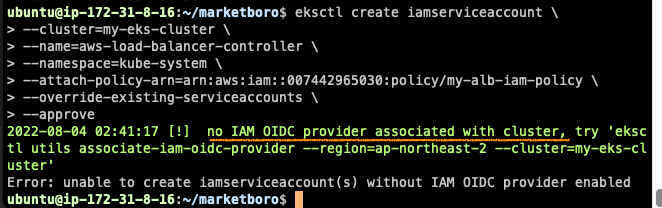

아래 명령어를 실행한다.

```bash
$ eksctl utils associate-iam-oidc-provider --region=ap-northeast-2 --cluster=my-eks-cluster --approve
```

그 후에 다시 iamserviceaccount 를 생성한다.

```bash
$ eksctl create iamserviceaccount \
--cluster=my-eks-cluster \
--name=aws-load-balancer-controller \
--namespace=kube-system \
--attach-policy-arn=arn:aws:iam::007442965030:policy/my-alb-iam-policy \
--override-existing-serviceaccounts \
--approve
```

OIDC 프로바이더를 통해 EKS Cluster 에 AWS ELB 에 대한 생성 관리 권한을 OIDC 에 맵핑이 되도록 설정하여 해당 권한을 SA(aws-load-balancer-controller) 에게 넘겨준다.
즉, OIDC 프로바이더는 외부에서 권한을 가져와서 클러스터 내의 SA(aws-load-balancer-controller) 에 그 권한을 다시 부여하는 것이다.

```bash
$ kubectl get sa -n kube-system
$ kubectl get sa aws-load-balancer-controller -n kube-system -o yaml
```

OIDC 를 통해 eks 클러스터는 eksctl 에서 생성한 계정(aws-load-balancer-controller)을 통해 AWS 에 접근할 수 있는 권한을 얻고 어떤 AWS 서비스에 접근할 수 있는지에 대한 정보는 annotations 의 role-arn 에 적혀있다. 
이 role 은 테라폼에서 생성한 my-alb-iam-policy 정책을 사용한다.

## alb-controller 설정
[공식 문서](https://aws.amazon.com/ko/premiumsupport/knowledge-center/eks-alb-ingress-controller-setup/)

공식 문서 가이드를 따라 아래 명령어를 실행한다.
```bash
curl -Lo ingress-controller.yaml https://github.com/kubernetes-sigs/aws-load-balancer-controller/releases/download/$VERSION/v2_4_1_full.yaml
```

클러스터의 cluster-name 을 현재 사용 중인 클러스터의 이름으로 변경한다.
```yaml
spec:
    containers:
    - args:
        - --cluster-name=my-eks-cluster # edit the cluster name
        - --ingress-class=alb
```

alb-controller.yaml 를 배포하기 앞서 alb 컨트롤러는 인증서를 적용할 수 있는지 확인하고 인증서를 관리하는 cert-manager.yaml 을 먼저 배포하고 그 후에 alb-controller.yaml 를 배포해야 한다.

```bash
# ~/marketboro/k8s
$ kubectl create -f cert.manager.yaml

$ kubectl get po -n cert-manager

$ kubectl create -f alb-controller.yaml

$ kubectl get po -n kube-system
```

## 백엔드 작업

Express 프레임워크를 사용하여 간단한 회원가입, 로그인, 헬스 체크 API 구현

## Dockerfile 작성

```bash
FROM node:16.15.1-alpine
WORKDIR /app
COPY package*.json ./
ENV PORT $PORT
ENV DB_NAME $DB_NAME
ENV DB_USER $DB_USER
ENV DB_PWD $DB_PWD
ENV DB_HOST $DB_HOST
ENV SECRET_KEY $SECRET_KEY
RUN npm install
COPY . .
CMD ["npm", "run", "start"]
EXPOSE 8080
```

```bash
# ~/marketboro/backend
$ docker login
$ docker build -t how0326/marketboro:latest .
$ docker push how0326/marketboro:latest
```

## config, secret 디렉토리 생성

Dockerfile 에서 입력받을 환경 변수를 configMap 파일과 secret 파일에 작성한 후 아래 명령어를 실행한다.

```bash
# ~/marketboro/k8s
$ kubectl create secret generic secret-configs --from-file=secret-configs
$ kubectl create configmap configs --from-file=configs
```

```yaml
# my-app-deployment.yaml
...
      containers:
        - name: my-app
          image: how0326/marketboro:latest
          envFrom:
            - secretRef:
                name: secret-configs
            - configMapRef:
                name: configs
```

## k8s manifest

```bash
# ~/marketboro/k8s/service
$ kubectl create -f ingress-alb.yaml
$ kubectl create -f my-app-service.yaml
$ kubectl create -f my-app-deployment.yaml
$ watch kubectl get svc,ing,pod,deploy
```

$ kubectl get ing 에 로드 밸런서 주소가 부착된 것을 확인할 수 있다. 해당 로드밸런서 주소로 이동하면 인그레스가 인그레스 룰에 의해 서비스로 경로를 라우팅해준다.

argo-cd, argo-rollout 을 통해 배포를 할 것이기 때문에 아래 명령어로 리소스들을 삭제해준다. 
```bash
# ~/marketboro/k8s/service
$ kubectl delete -f .
```

## API 

1. POST /api/v1/auth/signup
```json
{
  "email": "email@email.com",
  "password": "12345"
}
```
   
2. POST /api/v1/auth/signin
```json
{
  "email": "email@email.com",
  "password": "12345"
}
```

3. GET /api/v1/health

## Jenkins CI
Jenkins 설치 스크립트
```bash
sudo apt update

sudo apt-get install default-jdk -y
java -version

sudo apt install maven -y
mvn --version

wget -q -O - https://pkg.jenkins.io/debian/jenkins.io.key | sudo apt-key add -
echo deb http://pkg.jenkins.io/debian-stable binary/ | sudo tee /etc/apt/sources.list.d/jenkins.list
sudo apt update
sudo apt install jenkins -y

# 젠킨스 사이트 접속 시 필요한 초기 비밀번호 출력
sudo cat /var/lib/jenkins/secrets/initialAdminPassword
```

젠킨스 설치를 하면 jenkins 유저가 생성된다.
jenkins 유저로 변경한 후 공개키와 개인키를 생성한다.

```bash
$ sudo su - jenkins
$ ssh-keygen
$ cat .ssh/id_rsa.pub
```

공개키를 GitHub Settings -> SSH and GPG Key 에 등록한다.
이제 jenkins 유저는 ssh 형태로 깃허브 레포지토리에 접근이 가능해진다.

<Bastion Host Public IP>:8080 으로 Jenkins 웹에 접속한다.
초기 비밀번호를 입력하고 기본 플러그인을 설치한 뒤, docker, docker pipeline 플러그인을 설치한다.

Jenkinsfile 에서 사용할 도커 허브 계정, 깃허브 계정 Credentials 를 등록한다.
Jenkins 관리 → Manage Credentials → Domains (global) → Global credentials → Add Credentials
1. 깃허브 계정을 젠킨스에 등록
- Kind: Username with Password
- Username: GitHub 계정명
- Password: GitHub에서 발급받은 토큰 값(Settings-Developer settings-Personal access tokens)
- ID: 젠킨스 내에서 해당 크레덴셜을 가리키기 위해 사용할 변수 이름을 지정한다.

2. 도커허브 계정을 젠킨스에 등록
- Kind: Username with Password
- Username: 도커 허브 계정명
- Password: 도커 허브에서 발급받은 토큰 값
- ID: 젠킨스 내에서 해당 크레덴셜을 가리키기 위해 사용할 변수 이름을 지정한다.

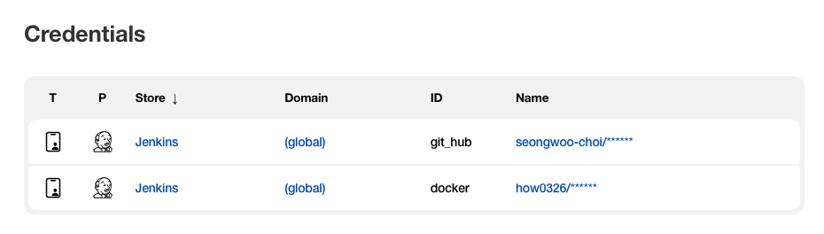

파이프라인 생성

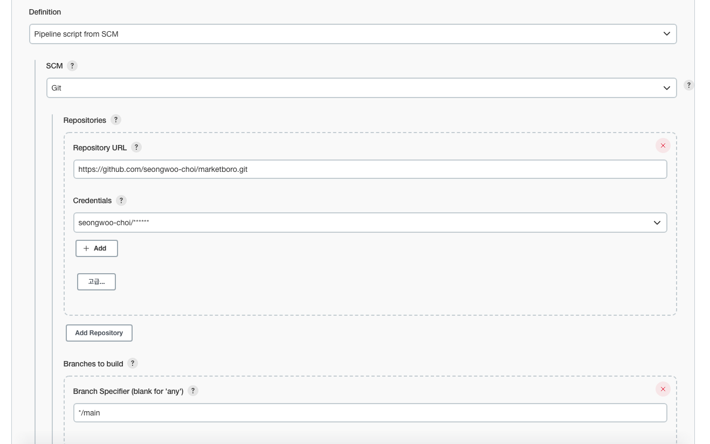

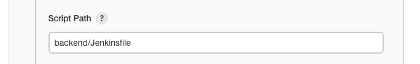

Jenkinsfile 스크립트 실행 결과

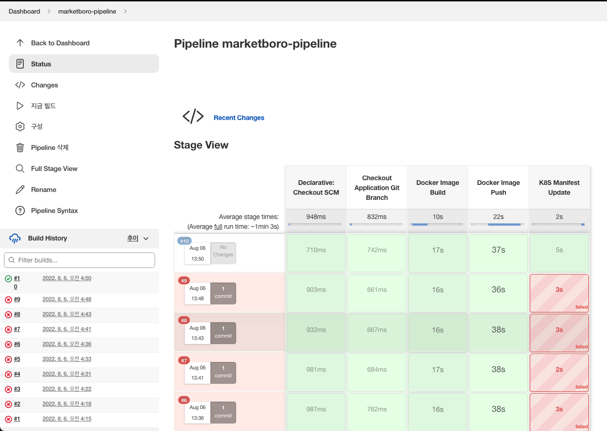

## ArgoCD 설치

```bash
# ~/marketboro/argo-management/script
$ chmod +x argocd.sh
$ ./argocd.sh
```

ArgoCD 설치 스크립트
```bash
# ArgoCD namespace 생성
kubectl create namespace argocd

# ArgoCD 설치
kubectl apply -n argocd -f https://raw.githubusercontent.com/argoproj/argo-cd/stable/manifests/install.yaml

# argocd-server 서비스 타입을 LoadBalancer 로 변경
kubectl patch svc argocd-server -n argocd -p '{"spec": {"type": "LoadBalancer"}}'

# ArgoCD Web UI 접속에 필요한 PWD 확인
kubectl -n argocd get secret argocd-initial-admin-secret -o jsonpath="{.data.password}" | base64 -d; echo
```

```bash
$ kubectl get all -n argocd
```

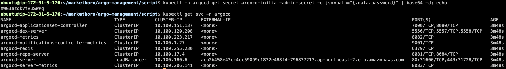

ArgoCD Web UI 에서 jenkins 유저에서 생성한 private key 를 사용하여 깃허브 레포지토리와 ssh 연결을 한다.

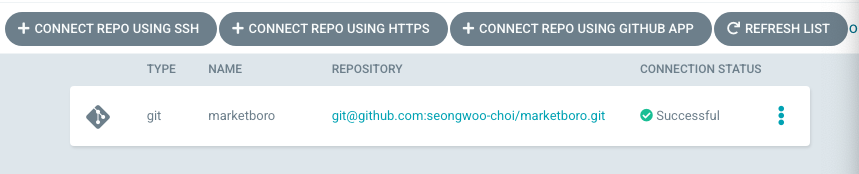

## ArgoCD Application 생성

Web UI 에서 CD 설정을 진행한다.

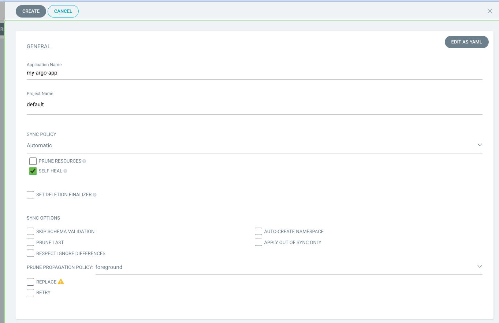
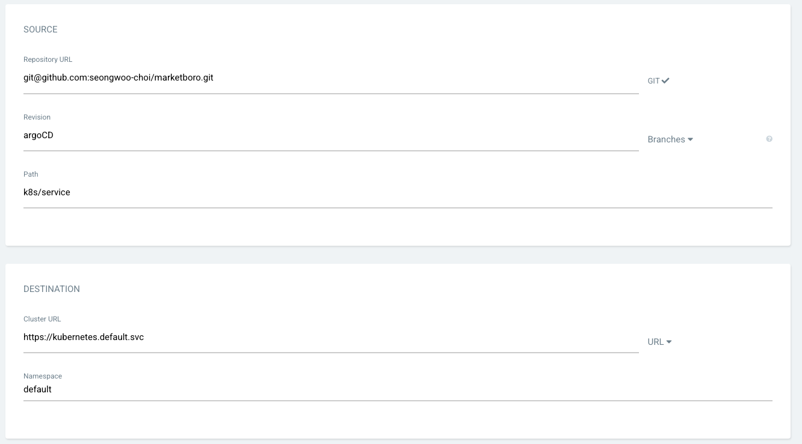

- source: repository URL 에서 미리 등록한 git repository 를 선택한 후, 배포할 application 의 위치(git repository)를 Path 에 입력한다.
- destination: kubernetes 의 어느 cluster 에 배포할지, 어떤 namespace 에 배포할지를 결정한다.

gitOps 방식의 CD 이기 때문에 깃허브 레포지토리의 argoCD 브랜치의 k8s/service 디렉토리에서 커밋 내역이 발생한 경우 CD 가 진행된다.

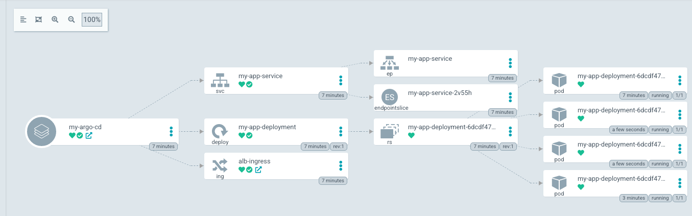

실제 API 가 잘 작동하는 것을 확인할 수 있다.

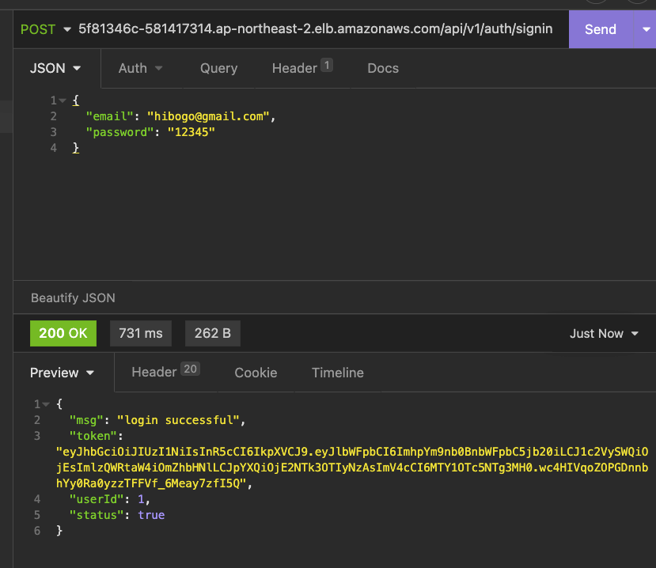

## Argo Rollout 설치

```bash
# ~/marketboro/argo-management/script
$ chmod +x argocd-rollout.sh
$ ./argocd-rollout.sh
```

Argo Rollout 설치 스크립트
```bash
# argo-rollouts namespace 생성
kubectl create namespace argo-rollouts

# argo-rollouts 설치
kubectl apply -n argo-rollouts -f https://github.com/argoproj/argo-rollouts/releases/latest/download/install.yaml

# kubectl plugin 설치
curl -LO https://github.com/argoproj/argo-rollouts/releases/latest/download/kubectl-argo-rollouts-linux-amd64

chmod +x ./kubectl-argo-rollouts-linux-amd64 

sudo mv ./kubectl-argo-rollouts-linux-amd64 /usr/local/bin/kubectl-argo-rollouts

kubectl argo rollouts version

# argo-rollout dashboard 를 백그라운드로 가동
kubectl argo rollouts dashboard &
```

<Bastion Host IP>:3100 으로 Argo Rollouts 대시보드에 접속할 수 있다. (Bastion Host 보안그룹에 3100 번 포트에 대해 열려있어야 한다.)

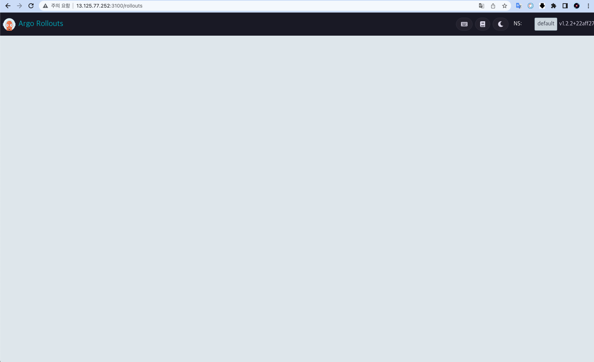

```bash
$ kubectl get all -n argo-rollouts
```

## Argo Rollout

canary 배포를 위한 canary-rollout.yaml, canary-rollout-service.yaml 파일을 생성한다.

```bash
# ~/marketboro/argo-rollout
$ kubectl create -f .
$ kubectl argo rollouts list rollout
$ kubectl argo rollouts status canary-my-app
```

gitOps 방식이기 때문에 깃허브 레포지토리에 커밋이 일어나야 CD -> Argo Rollout 이뤄진다.

```yaml
...
        spec:
          containers:
            - name: canary-rollout-my-app
              image: how0326/marketboro:latest # -> canary 태그로 변경 후 깃허브에 커밋
              ports:
                - containerPort: 8080
              resources:
                requests:
                  memory: 32Mi
                  cpu: 5m
```

Argo Rollout Dashboard 접속 후 카나리 배포 과정을 확인이 가능하다. 혹은 아래 명령어로 변경 과정을 확인할 수 있다.

```bash
$ kubectl argo rollouts get rollout canary-my-app --watch
```

## 오류
1. metadata of serviceaccounts that exist in Kubernetes will be updated, as --override-existing-serviceaccounts was set
eksctl create iamserviceaccount 생성 시 해당 오류가 발생했다.
CloudFormation 에서 중복으로 생성된 ksctl-my-eks-cluster-addon-iamserviceaccount-kube-system-aws-node 스택을 제거 후 재설치
[참조](https://github.com/weaveworks/eksctl/issues/3109#issuecomment-763228910)

2. /var/run/docker.sock의 permission denied 발생
/var/run/docker.sock 파일의 권한을 666으로 변경하여 그룹 내 다른 사용자도 접근 가능하게 변경
```bash
sudo chmod 666 /var/run/docker.sock 
```
[참조](https://github.com/occidere/TIL/issues/116)