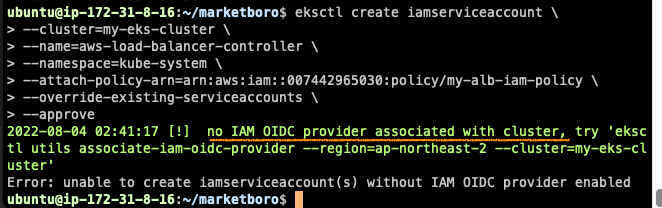

# marketboro

## eksctl? terraform?

기존의 [프로젝트](https://github.com/seongwoo-choi/OTT-Service-BE/blob/main/project_myeks.yaml)에서는 eksctl create -f project_myeks.yaml 을 사용하여 YAML 파일을 사용하여 EKS 를 구성했다.

이번 사전 과제에서는 Terraform 을 사용하여 EKS 를 구성하고자 한다.

## Terraform 구성 사항

1. AWS Network 구성
- VPC
- Public Subnet, Private Subnet
- Public Subnet Route Table
- Internet Gateway
- Nat Gateway
- Elastic Ip

2. AWS EKS 구성
- EKS Cluster
- EKS NodeGroup
- Security Group
- IAM Policy
- IAM Role

3. Bastion Host 구성
- EC2 instance
- IAM Role
- IAM Policy
- Security Group
- IAM Instance Profile

## aws console 에 Bastion Host 접속 용 키 페어 등록
ec2-key-pair 라는 이름으로 키 페어 등록

## 로컬 머신에서 Terraform 실행
```bash
$ terraform init
$ terrform plan
$ terraform apply
```

## EKS Kubeconfig 설정
```bash
$ ssh -i "ec2-key-pair" ubuntu@<Bastion Host Public Ip>

# aws cli 설치
$ sudo apt update && sudo apt install unzip
$ curl "https://awscli.amazonaws.com/awscli-exe-linux-x86_64.zip" -o "awscliv2.zip"
$ unzip awscliv2.zip
$ sudo ./aws/install
$ aws --version

# git clone https://github.com/seongwoo-choi/marketboro.git 으로 변경 예정
$ git clone -b k8s --single-branch https://github.com/seongwoo-choi/marketboro.git

$ aws configure

$ aws eks update-kubeconfig --region <Region 명> --name <EKS Cluster 명>
$ aws eks update-kubeconfig --region ap-northeast-2 --name my-eks-cluster
```

## kubectl cli 설치
[공식 문서](https://docs.aws.amazon.com/ko_kr/eks/latest/userguide/install-kubectl.html)
```bash
$ curl -o kubectl https://s3.us-west-2.amazonaws.com/amazon-eks/1.21.2/2021-07-05/bin/linux/amd64/kubectl

$ chmod +x ./kubectl && sudo mv ./kubectl /usr/local/bin/

$ kubectl version
```

## Docker 설치 스크립트
```bash
# docker.sh
DOCKER_USER=ubuntu

sudo apt-get update

sudo apt-get install \
    ca-certificates \
    curl \
    gnupg \
    lsb-release -y

sudo mkdir -p /etc/apt/keyrings

curl -fsSL https://download.docker.com/linux/ubuntu/gpg | sudo gpg --dearmor -o /etc/apt/keyrings/docker.gpg

echo \
  "deb [arch=$(dpkg --print-architecture) signed-by=/etc/apt/keyrings/docker.gpg] https://download.docker.com/linux/ubuntu \
  $(lsb_release -cs) stable" | sudo tee /etc/apt/sources.list.d/docker.list > /dev/null

sudo apt-get update

sudo apt-get install docker-ce docker-ce-cli containerd.io docker-compose-plugin -y

sudo usermod -aG docker $DOCKER_USER
```
```bash
$ chmod +x docker.sh
$ ./docker.sh
```

## eksctl cli 설치
[공식 문서](https://docs.aws.amazon.com/ko_kr/eks/latest/userguide/eksctl.html)
```bash
$ curl --silent --location "https://github.com/weaveworks/eksctl/releases/latest/download/eksctl_$(uname -s)_amd64.tar.gz" | tar xz -C /tmp

$ sudo mv /tmp/eksctl /usr/local/bin

$ eksctl version
```

## Jenkins 설치 
```bash
$ docker run --name jenkins -d -p 8080:8080 -v ~/jenkins:/var/jenkins_home -u root jenkins/jenkins:latest
```

## ingress-alb IAM Policy 생성
ALB 를 사용하기 위한 IAM 정책을 생성한다.

[alb 공식문서](https://docs.aws.amazon.com/ko_kr/eks/latest/userguide/aws-load-balancer-controller.html)

위 문서를 참고하여 IAM 정책을 다운받은 후 iam-policy.tf 에 해당 정책을 연결하여 생성한 상태

해당 정책을 EKS 내에서 ALB 서비스를 관장하는 SA 에 붙여줄 것이다.

## cert-manager 배포

cert-manager가 설치되어 있지 않을 경우 AWS Load Balancer Controller에서 Certificate를 배포하지 못한다. 미리 설치되어 있어야 한다.
[공식 문서](https://aws.amazon.com/ko/premiumsupport/knowledge-center/eks-alb-ingress-controller-setup/)
[cert-manager 다운로드 링크](https://github.com/jetstack/cert-manager/releases/download/v1.5.4/cert-manager.yaml)
[cert-manager releases](https://github.com/cert-manager/cert-manager/releases)
```bash
$ cd ~/marketboro/k8s
$ kubectl create -f cert-manager.yaml
```

## aws-load-balancer-controller IAM Role / EKS SA 생성
eksctl 명령어로 EKS 내에서 ALB 서비스를 관장하는 SA 를 생성한다.

위에서 생성한 alb 용 IAM Policy 를 붙여준다.

```bash
$ eksctl create iamserviceaccount \
--cluster=my-eks-cluster \
--name=aws-load-balancer-controller \
--namespace=kube-system \
--attach-policy-arn=arn:aws:iam::007442965030:policy/my-alb-iam-policy \
--override-existing-serviceaccounts \
--approve
```
위 명령어를 실행할 시 아래와 같이 no IAM OIDC provider associated with cluster, try 'eksctl utils associate-iam-oidc-provider --region=ap-northeast-2 --cluster=my-eks-cluster' 문구가 발생한다.



아래 명령어를 실행한다.

```bash
$ eksctl utils associate-iam-oidc-provider --region=ap-northeast-2 --cluster=my-eks-cluster --approve
```

그 후에 다시 iamserviceaccount 를 생성한다.

```bash
$ eksctl create iamserviceaccount \
--cluster=my-eks-cluster \
--name=aws-load-balancer-controller \
--namespace=kube-system \
--attach-policy-arn=arn:aws:iam::007442965030:policy/my-alb-iam-policy \
--override-existing-serviceaccounts \
--approve
```

OIDC 프로바이더를 통해 EKS Cluster 에 AWS ELB 에 대한 생성 관리 권한을 OIDC 에 맵핑이 되도록 설정하여 해당 권한을 SA(aws-load-balancer-controller) 에게 넘겨준다.
즉, OIDC 프로바이더는 외부에서 권한을 가져와서 클러스터 내의 SA(aws-load-balancer-controller) 에 그 권한을 다시 부여하는 것이다.

```bash
$ kubectl get sa -n kube-system
$ kubectl get sa aws-load-balancer-controller -n kube-system -o yaml
```

OIDC 를 통해 eks 클러스터는 eksctl 에서 생성한 계정(aws-load-balancer-controller)을 통해 AWS 에 접근할 수 있는 권한을 얻고 어떤 AWS 서비스에 접근할 수 있는지에 대한 정보는 annotations 의 role-arn 에 적혀있다. 
이 role 은 테라폼에서 생성한 my-alb-iam-policy 정책을 사용한다.

## alb-controller 설정
[공식 문서](https://aws.amazon.com/ko/premiumsupport/knowledge-center/eks-alb-ingress-controller-setup/)

AWS GitHub에서 AWS 로드 밸런서 컨트롤러에 대해 다운로드한 매니페스트 파일에서 다음 명령을 실행한다.
```bash
curl -Lo ingress-controller.yaml https://github.com/kubernetes-sigs/aws-load-balancer-controller/releases/download/$VERSION/v2_4_1_full.yaml
```
클러스터의 cluster-name 을 편집한다.
```bash
spec:
    containers:
    - args:
        - --cluster-name=my-eks-cluster # edit the cluster name
        - --ingress-class=alb
```

alb-controller.yaml 를 배포하기 앞서 alb 컨트롤러는 인증서를 적용할 수 있는지 확인하고 인증서를 관리하는 cert-manager.yaml 을 먼저 배포하고 그 후에 alb-controller.yaml 를 배포해야 한다.

```bash
# ~/marketboro/k8s
$ kubectl create -f cert.manager.yaml

$ kubectl get po -n cert-manager

$ kubectl create -f alb-controller.yaml

$ kubectl get po -n kube-system aws-load-balancer-controller
```

## 오류
1. eksctl create iamserviceaccount 생성 시 아래와 같은 오류가 발생했다.
metadata of serviceaccounts that exist in Kubernetes will be updated, as --override-existing-serviceaccounts was set -> CloudFormation 에서 중복으로 생성된 ksctl-my-eks-cluster-addon-iamserviceaccount-kube-system-aws-node 스택을 제거 후 재설치
[참조](https://github.com/weaveworks/eksctl/issues/3109#issuecomment-763228910)